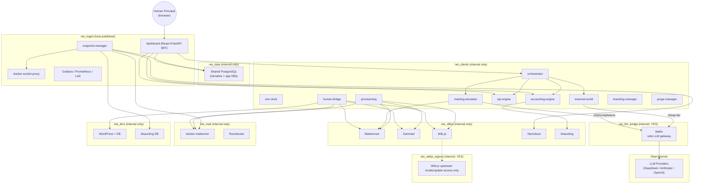

# FakeCo "Real Appliances"

A simulated software company that runs entirely inside Docker — AI-driven "employees" hold
standups, write wiki pages, file support tickets, close deals, take PTO, and get raises or fired,
all through real API calls against real, unmodified self-hosted business applications. A human
operator (the **Principal**) watches and steers the whole thing through a purpose-built control
dashboard.

## Table of Contents

1. [Overview & Architecture](#overview--architecture)
2. [Setup & Deployment Guide](#setup--deployment-guide)
3. [Control Dashboard Walkthrough](#control-dashboard-walkthrough)
4. [Troubleshooting, Operations & Known Limitations](#troubleshooting-operations--known-limitations)

---

# Overview & Architecture

## What This Project Is

**FakeCo "Real Appliances"** is a simulated software company that runs entirely inside Docker. It isn't a mockup or a slide deck — it's a live stack of 39+ containers in which AI-driven "employees" hold standups, write wiki pages, file support tickets, close deals, take PTO, get raises, and get fired, all by making real API calls against **real, unmodified self-hosted business applications**: Mattermost for team chat, Zammad for helpdesk tickets, Wiki.js for the company wiki, Nextcloud for file/document storage, WordPress for the public-facing site, Akaunting for double-entry accounting, a real mailserver (docker-mailserver) with Roundcube webmail, and a Grafana/Prometheus/Loki stack for observability. Every "employee" is a real user account on every one of these appliances — the same as if a human had signed up.

What makes the simulation move is a layer of ~19 custom Python/FastAPI microservices that sit alongside the appliances. They advance a simulated clock, decide who should be in which meeting today, call an LLM to generate what gets said, post the results into Mattermost/Wiki.js/Zammad through their real REST and GraphQL APIs, and post the financial consequences into Akaunting as real transactions. Deterministic business logic (payroll, KPI scoring, accounting) is written as plain Python — never delegated to the LLM — while narrative content (meeting dialogue, emails, wiki updates) is LLM-generated through a single shared gateway.

A human operator — the **Principal** — watches and steers all of this through a purpose-built React + FastAPI **control dashboard**: adjusting simulation speed, approving or rejecting expenses and raises, hiring/firing employees, injecting messages as any employee, triggering chaos events, and taking/restoring snapshots of the entire stack. The project's guiding idea is that this all has to be *real*: real appliance databases, real HTTP APIs, real accounts, real transactions — the simulation is built on top of the same software a real company would run, not a simplified stand-in for it.

## Architecture Diagram



The only two networks with real internet egress are `net_llm_bridge` (LiteLLM, reaching actual LLM provider APIs) and `net_wikijs_egress` (Wiki.js's own dedicated locale/update channel). Every appliance and every custom service otherwise lives on an `internal: true` Docker network with no route to the outside world.

## Service Inventory

All custom services are Python/FastAPI, built from their own `Dockerfile`, and gated behind Compose `profiles:` (typically `phaseN`, matching the phase in which they were introduced — several are also added to later dashboard-integration phases, e.g. `phase34`/`phase36`).

| Service | Phase | Purpose |
|---|---|---|
| `sim-clock` | 12 | Owns the simulated clock (`sim_time`) in Postgres and a configurable `speed_multiplier` (0.1x–10.0x). Every time-aware decision in the system reads `sim_time` from here — never wall-clock. |
| `narrative-db-migrate` | 13 | Init container that applies all SQL migrations in `narrative-db/migrations/` in order, then exits; every other service depends on it completing first. |
| `provisioning` | 14 | Creates real per-employee accounts across docker-mailserver, Mattermost, Zammad, and Wiki.js; idempotent; also handles the "fire" path (deactivate, never delete). Runs as a CLI and, since Phase 34, also as an HTTP "serve" mode backing the dashboard's Hire/Fire controls. |
| `accounting-engine` | 15 | Deterministic double-entry accounting logic — expense approval routing, payroll runs (one aggregate Akaunting transaction per cycle), revenue posting, and a "books auditor" reconciliation job. All financial math is plain code, never the LLM. |
| `meeting-simulator` | 16 | Runs all simulated meeting types (standup, cross-functional, performance review, crisis response, and a not-yet-wired pay-negotiation type) by building a structured prompt, calling LiteLLM's "heavy" model tier, and posting the outcome to Mattermost/Wiki.js/accounting-engine. |
| `human-bridge` | 17 | Backend for the Principal's "act as an employee" powers: send mail or Mattermost posts as any employee, open/close Zammad tickets, approve/reject pending approvals, edit Wiki.js pages, set company directives, and detect+react to the Principal's own activity across appliances. |
| `orchestrator` | 18 (+19, 27) | The simulation's heartbeat — a scheduler that makes zero LLM calls itself. On each tick it decides what needs to happen (standups, reviews, payroll, KPI rollups, PTO, stale-thread escalation, chaos/service-availability controls) and fires the appropriate service. |
| `external-world` | 21/22 | Generates the outside world: a rival company ("BetaCorp") that can poach underpaid employees with job offers, plus customer prospects, support tickets, and revenue events. Deterministic logic decides *whether* something happens; the LLM is used once, cheaply, to write the resulting email/ticket text. |
| `kpi-engine` | 23 | Deterministic daily KPI rollups across Zammad, Wiki.js, Mattermost, and Akaunting, plus the performance-review raise formula (top/second quartile raises by department). Zero LLM calls. |
| `branding-manager` | 30 | Manages the avatar/emoji asset library and pushes avatar images and a themed emoji pack to Mattermost, Zammad, and Wiki.js through each appliance's own real avatar-upload API. |
| `snapshot-manager` | 29 | Sidecar with direct network access to every appliance's database; captures/restores point-in-time snapshots (`pg_dump`/`mysqldump`/tar archives) without ever using `docker exec`, respecting the `EXEC=0` lock on docker-socket-proxy. |
| `purge-manager` | 29 | Scoped or full data purges, gated by a mandatory pre-purge snapshot (via snapshot-manager) plus a typed confirmation phrase — the audit/purge logs themselves are never purged. |
| `dashboard` | 33–37 | React/Vite SPA served by a thin FastAPI BFF, sitting entirely behind HTTP Basic Auth. Proxies to the services above for its tabs: Simulation/LLM Status/Narrative, HR/Payroll/Accounting, External World/KPI/Company Direction, Chaos/Data Management/Branding, and a TV-wall/Errors/deep-links view. |

## The Appliance Layer

| Appliance | Role in the simulation |
|---|---|
| **Mattermost** | Real-time team chat — standups, cross-functional discussion, DMs, Principal impersonation, custom emoji/avatars. |
| **Zammad** | Helpdesk/ticketing — expense approvals, customer support tickets, per-employee API tokens. |
| **Wiki.js** | Company wiki — meeting notes, company directives, documentation, all written via its GraphQL API. |
| **Nextcloud** | Intranet file storage — occasional document/deliverable uploads via WebDAV. |
| **WordPress** | Public-facing company site — occasional narrative-driven posts, kept isolated on `net_dmz`. |
| **Akaunting** | Real double-entry accounting — payroll, expenses, revenue, chart of accounts, P&L. |
| **docker-mailserver + Roundcube** | A real SMTP/IMAP mailserver with closed relay (accepts only `@fakecorp.internal`) plus a real webmail client for reading/replying as any employee. |
| **Grafana / Prometheus / Loki** | Observability — container/host metrics, log aggregation, and dashboards, including panels reading directly from Postgres and Akaunting's MySQL for financial/KPI visualization. |

## Network Security Model

The compose file's network block (`docker-compose.yml`, top of file) defines eight Docker networks, and this split is a deliberate, carefully maintained invariant, not an oversight:

- `net_clients`, `net_office`, `net_mail`, `net_dmz`, and `net_data` are all declared `internal: true` — no internet access and no host access. This is where every appliance and almost every custom service lives.
- `net_llm_bridge` is the **one** network declared `internal: false`, and `litellm` is the only container attached to it that talks to the outside world — its sole job is reaching real LLM provider APIs (DeepSeek, Anthropic, OpenAI). Every custom service that needs an LLM call reaches it through this single internal gateway; nothing else in the stack can dial out.
- `net_wikijs_egress` is a second, narrow `internal: false` network used only by Wiki.js, for its own upstream locale/update sync — kept deliberately separate from `net_llm_bridge` so Wiki.js cannot reach the LLM-provider-facing network or any other appliance's egress path. This was added later as an explicit, approved, case-by-case exception, not a general internet-access rule.
- `net_mgmt` is host-published (`internal: false`) so a human's browser can reach the dashboard, Grafana, and Traefik — but it is not an appliance network, and appliances are not attached to it directly (they're reached through Traefik, which is multi-homed onto it).

In short: **litellm and the Wiki.js locale-sync path are the only two things in this entire 39+ container stack with real internet access**, and that boundary has been treated as a hard constraint throughout the build (for example, `docker-socket-proxy`'s `EXEC=0` restriction deliberately blocks the "easy" way to snapshot/purge appliance data via `docker exec`, forcing `snapshot-manager` and `purge-manager` to talk to each appliance's database directly over the network instead).

## Tech Stack Summary

- **Custom services**: Python 3 + FastAPI, one container per service, each with its own `Dockerfile`; async I/O throughout via `asyncpg` and `httpx`.
- **Datastore**: a single shared PostgreSQL instance (`net_data`) holds the narrative/simulation schema, with per-appliance databases (Mattermost, Zammad, Wiki.js, Nextcloud all Postgres; WordPress and Akaunting on MariaDB) living alongside it or on `net_dmz`.
- **Dashboard**: React + Vite single-page app, served by a thin FastAPI backend-for-frontend that proxies to each owning microservice's API rather than duplicating business logic, protected end-to-end by HTTP Basic Auth.
- **LLM layer**: LiteLLM as the sole abstraction/gateway in front of multiple providers (DeepSeek → Anthropic → OpenAI fallback chain), so every custom service makes identical `/chat/completions`-style calls regardless of which provider ultimately serves the request.
- **Orchestration**: Docker Compose, with nearly every service gated behind a `profiles:` entry corresponding to the build phase that introduced it, so the stack can be brought up incrementally or fully.

---

# Setup & Deployment Guide

This section walks a stranger with zero prior context through bringing up the entire "Real
Appliances" stack from a fresh clone: prerequisites, first boot, the unavoidable post-first-boot
bootstrap of seven secrets, hosts-file setup so appliance web UIs resolve from your browser, how to
verify everything is healthy, and how to tear it down.

## Prerequisites

- **Docker Desktop**, with the Compose v2 plugin (`docker compose`, not the standalone
  `docker-compose` v1 binary). This stack was built and verified against `docker --version`
  `29.6.2` and `docker compose version` `v5.3.1` on Windows 11 Pro. Older versions may work but
  are untested.
- **Windows 11 with Docker Desktop's WSL2 backend** is the platform this was actually built and
  run on (shell used: PowerShell / git-bash). macOS/Linux should work the same way since it's all
  plain `docker compose`, but only Windows has been exercised.
- **Free RAM/disk**: not yet measured/documented anywhere in this repo (`important.md` and
  `BUILD_LOG.md` don't record a figure) — treat this as a **TODO** rather than trust a guess. As a
  rough sizing signal, the full stack is 39+ containers including Postgres, MySQL (Akaunting),
  Mattermost, Zammad, Wiki.js, Nextcloud, WordPress, a mail server, Prometheus/Loki/Grafana, and
  ~13 custom Python microservices, so budget generously (expect this to need several GB of RAM at
  minimum) and treat any real number you observe as more reliable than this note.
- A code editor to edit `.env`.
- At least one **real LLM provider API key** — DeepSeek, Anthropic, or OpenAI (`litellm/config.yaml`
  wires deployments for all three: `cheap-deepseek`/`cheap-anthropic`/`cheap-openai`,
  `mid-*`, and `heavy-*`). You only need one provider's key for the stack to generate any content
  at all; more providers just give LiteLLM more fallback options. A local model fallback
  (`LOCAL_LLM_BASE_URL`/`LOCAL_LLM_MODEL`) also exists — see `litellm/README.md`.

## Step-by-step first boot

**1. Clone the repo and create your `.env`:**

```bash
git clone https://github.com/Fr0styJ/PointlessProgram.git
cd PointlessProgram
cp .env.example .env
```

`.env` is git-ignored — never commit it.

**2. Fill in every variable in `.env` EXCEPT the seven first-boot bootstrap secrets.**

Open `.env` and set real values for: `PRINCIPAL_EMAIL`/`PRINCIPAL_NAME`, your LLM provider key(s),
`POSTGRES_USER`/`POSTGRES_PASSWORD`, `POSTMASTER_EMAIL`, `ROUNDCUBE_DB_PASSWORD`/`ROUNDCUBE_DES_KEY`,
`MATTERMOST_DB_PASSWORD`/`MATTERMOST_ADMIN_USER`/`MATTERMOST_ADMIN_PASSWORD`/`MATTERMOST_ADMIN_EMAIL`,
`ZAMMAD_DB_PASSWORD`/`ZAMMAD_ADMIN_USER`/`ZAMMAD_ADMIN_PASSWORD`/`ZAMMAD_ADMIN_EMAIL`,
`WIKIJS_DB_PASSWORD`/`WIKIJS_ADMIN_EMAIL`/`WIKIJS_ADMIN_PASSWORD`,
`AKAUNTING_DB_PASSWORD`/`AKAUNTING_ADMIN_EMAIL`/`AKAUNTING_ADMIN_PASSWORD`,
`NEXTCLOUD_ADMIN_USER`/`NEXTCLOUD_ADMIN_PASSWORD`/`NEXTCLOUD_DB_PASSWORD`,
`WORDPRESS_DB_PASSWORD`/`WORDPRESS_ADMIN_USER`/`WORDPRESS_ADMIN_PASSWORD`/`WORDPRESS_ADMIN_EMAIL`,
`TECHNITIUM_ADMIN_PASSWORD`, `LITELLM_MASTER_KEY`, `GRAFANA_ADMIN_USER`/`GRAFANA_ADMIN_PASSWORD`,
`TRAEFIK_DASHBOARD_PASSWORD`, `MAILSERVER_BOT_SECRET`, and `DASHBOARD_AUTH_USER`/
`DASHBOARD_AUTH_PASSWORD` (the dashboard container refuses to start without both of these set —
compose uses the `:?` required-var syntax for them). Leave `LITELLM_DATABASE_URL` as-is unless you
know you need to change it; the simulation-tuning vars near the bottom of the file are all optional
and have working defaults baked into `docker-compose.yml`.

Leave these **seven** variables blank for now — they literally cannot be obtained until the
relevant appliance has booted once (see step 4):

- `MATTERMOST_ADMIN_TOKEN`
- `MATTERMOST_BOT_TOKEN`
- `MATTERMOST_TEAM_ID`
- `PRINCIPAL_MATTERMOST_PASSWORD`
- `ZAMMAD_ADMIN_TOKEN`
- `WIKIJS_ADMIN_TOKEN`
- `WORDPRESS_ADMIN_APP_PASSWORD`

**3. Bring up the stack.** Nearly every service is gated behind a Compose `profiles:` entry named
`phaseN`; bringing up a meaningful subset (rather than one single service) usually requires
combining multiple `--profile` flags because of `depends_on` chains — check
`grep -n "profiles:" -A2 docker-compose.yml` if you ever need to confirm what a given service
needs. In practice you want the whole stack for this simulation to function, so bring up
**everything** by combining every profile from `phase2` through `phase37`:

```bash
docker compose \
  --profile phase2 --profile phase3 --profile phase4 --profile phase5 --profile phase6 \
  --profile phase7 --profile phase8 --profile phase9 --profile phase10 --profile phase11 \
  --profile phase12 --profile phase13 --profile phase14 --profile phase15 --profile phase16 \
  --profile phase17 --profile phase18 --profile phase21 --profile phase23 --profile phase29 \
  --profile phase30 --profile phase33 --profile phase34 --profile phase35 --profile phase36 \
  up -d
```

If you want to bring the stack up incrementally instead (e.g. to sanity-check networking/DNS
before adding appliances), useful smaller subsets are:

```bash
# Core plumbing only: postgres, socket-proxy, monitoring, Traefik, Technitium DNS
docker compose --profile phase2 --profile phase3 --profile phase4 --profile phase5 up -d

# + all office appliances (mail, Mattermost, Zammad, Wiki.js, Nextcloud/WordPress, Akaunting, Grafana)
docker compose --profile phase2 --profile phase3 --profile phase4 --profile phase5 \
  --profile phase6 --profile phase7 --profile phase8 --profile phase9 --profile phase10 \
  --profile phase11 up -d

# + the simulation engine itself (sim-clock, narrative-db, provisioning, accounting-engine,
# meeting-simulator, human-bridge, orchestrator, external-world, kpi-engine, purge/snapshot)
docker compose --profile phase2 --profile phase3 --profile phase4 --profile phase5 \
  --profile phase6 --profile phase7 --profile phase8 --profile phase9 --profile phase10 \
  --profile phase11 --profile phase12 --profile phase13 --profile phase14 --profile phase15 \
  --profile phase16 --profile phase17 --profile phase18 --profile phase21 --profile phase23 \
  --profile phase29 up -d
```

The full command above (adding `phase30`, `phase33`-`phase36`) additionally brings up
branding-manager and the control dashboard (HR/Payroll/Accounting/External World/KPI/Company
Direction/Chaos/Data Management/Branding/Settings tabs all live in that one `dashboard` service).

Give everything a couple of minutes to initialize — several appliances (Mattermost, Zammad,
Wiki.js, WordPress, docker-mailserver) run their own first-boot migrations/seed jobs before they
report healthy.

**4. Bootstrap the seven post-first-boot secrets, in this order** (each one is documented inline
in `.env.example` — this is the condensed sequence):

1. **`MATTERMOST_ADMIN_TOKEN`** — log the admin CLI in, then generate a token:
   ```bash
   docker exec fakeco-mattermost mmctl auth login http://localhost:8065 \
     --name local --username <MATTERMOST_ADMIN_USER> --password-file /dev/stdin
   docker exec fakeco-mattermost mmctl token generate <MATTERMOST_ADMIN_USER> "fakeco-automation"
   ```
   Copy the printed token into `.env`.
2. **`MATTERMOST_BOT_TOKEN`** — create a dedicated bot account (System Console → Integrations →
   Bot Accounts → Add Bot Account, or `docker exec fakeco-mattermost mmctl bot create <name>
   --display-name "FakeCo Bot"`), then generate a token for it the same way as step 1
   (`mmctl token generate <bot-username> "fakeco-bot"`).
3. **`MATTERMOST_TEAM_ID`** — create a team via the web UI if none exists yet, then
   `docker exec fakeco-mattermost mmctl team list` and copy the ID of the team employees should
   join.
4. **`PRINCIPAL_MATTERMOST_PASSWORD`** — whatever password you set when you (the Principal) log
   into Mattermost's web UI for your own human account for the first time; record it here.
5. **`ZAMMAD_ADMIN_TOKEN`** — log into Zammad as the admin, then Manage → API → "+" to create a
   new token for that user; copy it into `.env`.
6. **`WIKIJS_ADMIN_TOKEN`** — Admin panel → Utilities → API Access → enable the GraphQL API if
   it's off, then Users → your admin account → API Keys → create a new key (full access); copy the
   generated JWT into `.env`.
7. **`WORDPRESS_ADMIN_APP_PASSWORD`** — WordPress does **not** auto-run its install wizard from
   env vars; complete the install wizard once via the web UI (or `wp core install`) using the
   `WORDPRESS_ADMIN_*` credentials already in `.env`, then go to wp-admin → Users → your profile →
   Application Passwords → name it (e.g. `fakeco-human-bridge`) → Add New Application Password.
   WordPress only shows the generated value once — copy it into `.env` immediately.

**5. Recreate the containers that consume these secrets** so they pick up the newly-filled `.env`
values (env vars are only interpolated at container-create time — a plain `restart` is not
enough):

```bash
docker compose up -d --force-recreate orchestrator human-bridge meeting-simulator \
  accounting-engine dashboard
```

## Hosts file setup

Traefik (port 80) routes every appliance by `Host` header to `*.fakecorp.internal` hostnames — it
does not listen on distinct ports per appliance. For these hostnames to resolve from your **host**
browser (as opposed to from inside other containers, which use the internal Technitium DNS server
instead), you need static entries pointing each hostname at `127.0.0.1`. This is required to reach
appliance web UIs directly and to follow the dashboard's Deep Links panel out of the browser.

Add these entries (every `*.fakecorp.internal` Traefik-routed hostname found in
`docker-compose.yml`):

```
127.0.0.1 chat.fakecorp.internal
127.0.0.1 tickets.fakecorp.internal
127.0.0.1 wiki.fakecorp.internal
127.0.0.1 portal.fakecorp.internal
127.0.0.1 www.fakecorp.internal
127.0.0.1 accounting.fakecorp.internal
127.0.0.1 mail.fakecorp.internal
127.0.0.1 grafana.fakecorp.internal
```

**Windows** (PowerShell, run as Administrator):

```powershell
$hostsPath = "$env:SystemRoot\System32\drivers\etc\hosts"
Add-Content -Path $hostsPath -Value @'
127.0.0.1 chat.fakecorp.internal
127.0.0.1 tickets.fakecorp.internal
127.0.0.1 wiki.fakecorp.internal
127.0.0.1 portal.fakecorp.internal
127.0.0.1 www.fakecorp.internal
127.0.0.1 accounting.fakecorp.internal
127.0.0.1 mail.fakecorp.internal
127.0.0.1 grafana.fakecorp.internal
'@
```

**macOS/Linux** — append the same block to `/etc/hosts` (requires `sudo`):

```bash
sudo tee -a /etc/hosts <<'EOF'
127.0.0.1 chat.fakecorp.internal
127.0.0.1 tickets.fakecorp.internal
127.0.0.1 wiki.fakecorp.internal
127.0.0.1 portal.fakecorp.internal
127.0.0.1 www.fakecorp.internal
127.0.0.1 accounting.fakecorp.internal
127.0.0.1 mail.fakecorp.internal
127.0.0.1 grafana.fakecorp.internal
EOF
```

Grafana is actually exposed directly on host port 3000 as well (see below), so the hosts entry for
it is a convenience, not strictly required.

## Verifying it worked

**Check container health:**

```bash
docker ps
```

Look for `(healthy)` in the `STATUS` column for services that define a `healthcheck` block (most
custom Python services and several appliances). A service stuck at `(health: starting)` for more
than its configured `start_period` or showing `(unhealthy)` indicates a real problem — check
`docker logs <container>`. Note the healthcheck gotcha documented in `important.md`: every custom
service's Docker image is `python:3.12-slim`-based and has **no `curl`**, so their healthchecks use
a Python one-liner (`urllib.request.urlopen(...)`) instead — this is expected, not a bug.

**Reach the dashboard:**

The dashboard is published on host port **8090** (mapped from the container's internal 8000):

```
http://localhost:8090
```

It's gated by HTTP Basic Auth for the entire app (API + SPA) using `DASHBOARD_AUTH_USER` /
`DASHBOARD_AUTH_PASSWORD` from `.env` — your browser will prompt for these credentials.

**Reach a couple of appliances directly** (after the hosts-file step above):

- Mattermost: `http://chat.fakecorp.internal` — log in with `MATTERMOST_ADMIN_EMAIL` /
  `MATTERMOST_ADMIN_PASSWORD`, or the Principal's own account once created.
- Zammad: `http://tickets.fakecorp.internal` — log in with `ZAMMAD_ADMIN_EMAIL` /
  `ZAMMAD_ADMIN_PASSWORD`.
- Wiki.js: `http://wiki.fakecorp.internal`
- Akaunting: `http://accounting.fakecorp.internal`
- Grafana: `http://grafana.fakecorp.internal` or `http://localhost:3000` directly.
- Technitium DNS admin UI: `http://localhost:5380` (host-published directly, no hostname routing
  needed).
- Traefik's own dashboard: `http://localhost:8080`.

The dashboard's own **Deep Links panel** (Phase 37) is the fastest way to sanity-check all of this
at once — it lists all 8 named appliances with working links and the Principal's real
username/password read straight from `.env`.

**Expect these known issues, not new bugs you introduced** (per `bugs.md`, current as of
2026-08-01):

- LiteLLM is intentionally stopped by default in this dev environment — Principal-reaction workers
  (Mattermost/email/Zammad/Wiki.js) will queue pending reactions and pause rather than error until
  you explicitly start/restart the `litellm` container and it has a working provider key.
- Phase 24 (pay negotiation / performance-review-driven pay cuts) is not implemented — the
  dashboard's Payroll tab correctly blocks pay cuts pending this feature.
- The simulation speed slider (Phase 32) is intentionally shipped disabled with a "Coming Soon"
  label — this is a deliberate deferral, not a missing feature you broke.

## Bringing it down / starting fresh

To stop everything without deleting data:

```bash
docker compose down
```

Add `-v` to also delete named volumes (Postgres/MySQL data, Mattermost/Wiki.js/Nextcloud storage,
etc.) if you want a truly clean slate on the next `up`:

```bash
docker compose down -v
```

For resetting **simulation data only** (employees, narrative history, accounting transactions,
etc.) without tearing down the whole Docker stack, use the dashboard's own Settings tab, which
wires into the `purge-manager` and `snapshot-manager` services (Phase 29/36) for full purges and
point-in-time snapshots/restores — see the dashboard walkthrough section of this README for usage
details; this section is only about the Docker Compose lifecycle itself.

---

# Control Dashboard Walkthrough

The `dashboard/` service is the Principal's single window into the simulation: a React + Vite
single-page app served as static files by a thin FastAPI backend-for-frontend (BFF), which
aggregates and proxies calls to every other appliance/microservice rather than duplicating their
business logic. It does **not** run the simulation itself — orchestrator, sim-clock, and the rest
of the `fakeco-*` services do that regardless of whether the dashboard is even open. The dashboard
is the control plane and observation deck, not the appliances themselves.

## Accessing the dashboard

- The dashboard container listens on `net_mgmt` (the one network that's host-published,
  `internal: false`), so it's reachable from a browser on the Docker host at whatever port
  `docker-compose.yml` maps for the `dashboard` service (host port **8090**, see Setup above).
- **Every route is behind HTTP Basic Auth** — the API and the static SPA alike, with no exceptions
  except the container-internal `/health` check (which never reaches a browser). Credentials come
  from two required environment variables: `DASHBOARD_AUTH_USER` and `DASHBOARD_AUTH_PASSWORD`. If
  either is unset, the service fails safe: it refuses every request with a `503` rather than
  silently serving the dashboard unauthenticated. Set both in `.env` before first boot.
- Treat the dashboard as a genuine control plane: several tabs can stop containers, trigger crisis
  events, or destroy accumulated data. Basic Auth is the only thing standing between "anyone who
  can reach this port" and those controls — see the Settings tab section below for the most
  dangerous one.

## Simulation tab

Read-only sim-time display plus one real control:

- **Sim Time card**: current sim-time, current speed multiplier, and current wall-clock time (UTC),
  read live from `sim-clock`'s own clock endpoint.
- **Speed Slider card**: a range slider and a row of preset buttons (0.1x, 0.25x, 0.5x, 1x, 2x, 5x,
  10x) — all rendered **disabled**, with a "Coming Soon" badge and a tooltip explaining why:
  `sim-clock`'s speed is still a static environment variable baked in at container boot
  (`SPEED_MULTIPLIER`), and there is no live runtime speed-change API yet. This is Phase 32, which
  was explicitly deferred by the user rather than built — the control's *shape* was built now on
  purpose (per user sign-off) so the UI is ready the day Phase 32 lands, but clicking it does
  nothing today because there's genuinely nothing on the other end to call.
- **Orchestrator Tick Loop card**: shows whether the tick loop is Paused or Running, the wall-clock
  time of the last tick, and the configured tick interval, with a single **Pause tick loop /
  Resume tick loop** button. This is a real, working control — it pauses/resumes only
  orchestrator's own internal scheduling loop; it does not stop any container or the compose stack
  itself (the UI states this explicitly).

## LLM Status tab

- **Provider / Fallback Chain**: a table of model tiers and the ordered list of deployments each
  tier falls back through, parsed from the mounted `litellm/config.yaml` (no live
  config-introspection API was confirmed to exist, so this reads the config file directly).
- **Usage / Cost**: total all-time spend, total tokens, spend in the trailing wall-clock hour, and
  a "speed-adjusted burn" figure ($/sim-hour), plus a per-model breakdown table (calls, tokens,
  spend). This reuses the exact query logic from the Phase 31 Grafana `llm-spend.json` panel
  against LiteLLM's own spend-log table. The speed-adjusted number is real math, but until Phase 32
  makes speed live, it's just today's fixed multiplier applied to the same number — a low-value
  figure for now, more useful once speed changes are actually live.

## Narrative tab

Six read-only cards, refreshed automatically:

- **Open Threads** — narrative threads still open/in-progress, with crisis-priority threads
  visually flagged.
- **Action Items** — open and closed items with owner and due date.
- **Pending Reactions** — the queue of pending employee reactions awaiting processing.
- **Pending Approvals** — expense approvals still awaiting a decision (also surfaced on the
  Accounting tab).
- **Meetings** — recent meetings across all meeting types, including `crisis_response`.
- **Pending Actions Retry Queue** — a depth counter plus a recent-items table, surfacing anything
  stuck retrying against a backend service.

## HR / Org Chart tab

- **Roster table**: name, department, title, and status — active, vacant, terminated, resigned, or
  a synthesized **on-PTO** badge (derived from the PTO calendar and overlaid on "active" rows,
  approximate since PTO is sim-time-keyed and the check itself runs on wall-clock time — good
  enough for an at-a-glance badge, not used to gate anything).
- **+ Hire** button opens a modal form (name, department, title, role tier: IC or Lead) that calls
  provisioning's hire endpoint.
- **Fire** button per active employee opens a confirmation modal first. The modal is explicit about
  what actually happens: it deactivates the employee's Mattermost, Zammad, and Wiki.js accounts and
  restricts their mailbox — nothing is deleted, and status simply becomes "terminated."
- **Relationship Graph**: a force-directed node/edge graph (node = employee, edge = a relationship
  row, edge color/width = affinity score — blue for positive, red for negative). Clicking a node
  filters the graph down to that employee's own edges; a "Clear filter" button resets it.

## Payroll tab

- **Per-Employee Pay Editor**: a table with each active employee's current pay and an input field
  for a proposed new figure.
  - **Raises work now.** Entering a higher number enables the Save button, which applies the raise
    immediately via accounting-engine's existing raise endpoint and shows a confirmation toast.
  - **Pay cuts do not work, by deliberate design, not by bug.** If the typed figure is lower than
    current pay, the Save button stays disabled and an inline note explains why: *"Pay cuts require
    Phase 24 (pay negotiation meetings) — not yet built."* Phase 24 (the meeting type that's
    supposed to negotiate and gate a cut) was never implemented, and the project's own rule is that
    a cut must never apply directly without going through that negotiation — so rather than build a
    cut path that violates that rule, the control is simply disabled. The dashboard's backend
    mirrors this: its `/api/payroll/raise` endpoint is increase-only and will reject a decrease even
    if somehow called directly.
- **Payroll History**: a table of every raise applied (and any stub pay-cut-proposal log entries),
  timestamped with actor and reason.

## Accounting tab

- **Cash Balance** widget, read live from Akaunting, plus an **"Open in Akaunting"** link that
  deep-links straight to the real profit-and-loss report page (not just Akaunting's home page).
- **Expense Approval Queue**: pending expense requests with **Approve** / **Reject** buttons wired
  to accounting-engine's existing approval endpoints.
- **Audit-Correction Log**: a table of Books Auditor findings and corrections, including entries
  seeded by crisis scenarios like a "surprise audit."

## External World tab

- **BetaCorp News Feed**: a chronological feed of BetaCorp-related events (job offers sent,
  resignations, pay-gap flags).
- **Job Offers / Resignations**: the same feed filtered down to just those two event types.
- **Customer Pipeline / At-Risk list**: a sortable table (by status or deal size) of every customer,
  with assigned sales/support reps, and at-risk/churned rows visually flagged.
- **Revenue by Customer**: a bar chart, one bar per customer with posted revenue, joining the
  customer record to its actual Akaunting transaction — the same underlying data source as the
  Phase 31 Grafana revenue panel, just broken out per-customer here.

## KPI / Performance tab

- **Automatic vs. Review & Approve Mode** toggle: a real, live switch (writes to a small
  `kpi_engine_config` table, no restart needed) that controls whether performance-review raises
  apply immediately or get queued into the expense-approval queue instead. Note: this toggle
  genuinely controls the *raise* side of performance reviews; it does not (and cannot) affect
  cut-side behavior, since that still depends on the unbuilt Phase 24.
- **Department Scoreboard** and **Employee Scoreboard**: tables of KPI metrics over a configurable
  lookback window (30 days by default), the employee one sortable by metric via a dropdown.
- **Performance-Review Log**: past raises applied by the formula, tagged with a tier badge
  (top-quartile / second-quartile / rest) parsed out of the stored reason string.

## Company Direction tab

- A textarea showing the current company directive, with a **Save** button that writes a new
  version (the table is append-only/versioned — nothing is overwritten) and triggers a sync to the
  pinned "Company Direction" page in Wiki.js. The save confirmation reports the new version number
  and whether the Wiki.js sync succeeded.
- A collapsible **History** table listing every prior version with timestamp, author, and a content
  preview.

## Chaos tab

- **Appliance Status grid**: one row per `fakeco-*` container on the chaos allow-list, showing live
  running/stopped state.
  - **Stop** requires a confirmation modal first (reversible via Start, but disruptive while down).
  - **Start** and **Restart** fire immediately, no confirmation.
  - All three proxy straight to orchestrator's existing chaos endpoints.
- **Trigger Event**: a dropdown of canned crisis scenarios (Data Breach, Surprise Audit, Viral
  Public Complaint) plus a "Custom..." option with a free-text field, and a **Trigger Event**
  button. The UI explains what firing one does: opens a crisis narrative thread, convenes a
  `crisis_response` meeting with forced attendees, and — for scenarios with a real cost — submits a
  normal expense request through the usual approval flow. The result panel shows the resulting
  thread ID, forced attendees, and any audit/meeting/expense results.
- **Outage Log**: a table of past outages pulled from narrative events, in the same sim-time
  phrasing the simulation itself generates.

## Data Management tab

Scoped purges and snapshots live here. **Full purge does not** — it was deliberately moved
elsewhere (see Settings, below).

- **Scoped Purge**: a checkbox list of ten independent scopes — Emails, Chat, Tickets, Wiki,
  Meetings & narrative memory, Accounting ledger, External world, KPI history, Roster, and Company
  direction. Checking one or more scopes and clicking **Purge Selected (N)** opens a confirmation
  modal that lists exactly which scopes are about to be destroyed and requires typing an exact
  confirmation phrase before the button enables (each scope has its own phrase, e.g. `PURGE
  EMAILS`, `PURGE CHAT`, `PURGE WIKI`, `PURGE MEETINGS AND NARRATIVE MEMORY`, `PURGE ACCOUNTING
  LEDGER`, `PURGE EXTERNAL WORLD`, `PURGE KPI HISTORY`, `PURGE ROSTER`, `PURGE COMPANY DIRECTION`,
  `PURGE TICKETS`; selecting multiple scopes requires typing all of their phrases joined together).
  A pre-purge snapshot is taken automatically before anything is deleted.
- **Snapshots**: a table of existing snapshots (name, sim-time tag, wall-clock capture time, size),
  a **Save Snapshot Now** button, and per-snapshot **Restore** and **Delete** buttons.
  - Restore opens its own confirmation modal requiring the exact phrase `RESTORE SNAPSHOT` — it
    warns explicitly that restoring discards everything since that snapshot, across every
    appliance.
  - Delete opens a lighter confirmation (no typed phrase) and only removes the stored backup file
    itself — it does not touch any live data.

## Branding tab

- **Asset Library**: a grid preview of avatar images and the emoji pack, streamed through the BFF
  (branding-manager isn't on the browser-reachable network, so the dashboard proxies its image
  bytes).
- **Per-Employee Avatar Picker**: pick one employee and one avatar, then **Apply**.
- **Bulk Apply**: multi-select employees via checkboxes, choose a mode (Randomize / Apply one to
  all / Reset to default), and (for "apply one to all") pick which avatar, then apply to all
  selected at once.

## Settings tab / the full-purge "nuclear launch" flow

> **⚠️ WARNING: This control permanently destroys the entire simulation's accumulated state.**
> Every employee and their roster history, every Mattermost message and channel, every Zammad
> ticket, every Wiki.js page, every meeting/action-item/narrative thread, the entire Akaunting
> accounting ledger (all transactions and documents), all external-world customer/revenue history,
> all KPI history, and all Company Direction history — gone, all at once, with no partial option.

By deliberate user sign-off, this control is **not** on the Data Management tab at all — it lives
alone on the Settings tab, in a visually distinct, deliberately alarming "☢ Full Data Purge — Danger
Zone" section, separate from every routine control in the dashboard. Above the button, the tab
shows when the last snapshot was taken (or "No snapshot has ever been taken" / "Unknown" if
snapshot-manager is unreachable) so the operator can see whether a safety net exists before
clicking anything — though a fresh pre-purge snapshot is taken automatically as part of the purge
itself regardless of what's shown here.

Firing the purge requires **four separate affirmative clicks** across a guided sequence — not four
clicks on the same dialog:

1. **"I want to purge all data"** — the initial arming click, on the Danger Zone card itself.
2. **Step 1 of 3 — "Are you absolutely sure?"** modal: restates in full what will be destroyed and
   that it cannot be undone from within the dashboard (only a separately-gated snapshot restore
   could recover any of it). Requires clicking **"I understand, continue."**
3. **Step 2 of 3 — "Type the confirmation phrase"** modal: requires typing the exact phrase
   `PURGE EVERYTHING` (not a checkbox, not a "yes" click) before **Continue** enables.
4. **Step 3 of 3 — "This is your last chance"** modal: states plainly that clicking the button below
   fires the actual purge immediately with no further confirmation. Requires clicking
   **"Execute Full Purge."**

Only after that fourth click does the dashboard's backend ever call purge-manager's real
`/purge/full` endpoint. That endpoint is a second, independent gate — it re-validates the typed
phrase and performs its own mandatory pre-purge snapshot server-side regardless of what the browser
already did, so this is two separate enforcement points, not one gate trusted twice. There is no
way to reach this endpoint from anywhere else in the dashboard's UI.

## TV wall (`/tv` route)

A separate, no-navigation spectator view, opened via the "TV Wall ↗" link in the top nav (opens in
a new tab). It is still gated behind the same dashboard-wide HTTP Basic Auth as every other route —
there is no separate, weaker access path for it. It has no interactive controls at all; it silently
auto-cycles through five panels roughly every 18 seconds: Live Chat Feed (recent Mattermost posts
across channels), Live Ticket Feed (recent Zammad tickets), Financial Snapshot (cash balance,
pending approvals, retry-queue depth), KPI Highlights (top movers by metric total), and Simulation
Status (sim time, speed, tick-loop state). A previously-considered "weekly digest" panel was
deliberately left out — the weekly-digest generator (Phase 25) was confirmed not to exist anywhere
in the codebase, so the panel was skipped rather than built against fake content.

## Errors panel

Part of the combined "Errors & Log Tail" tab. Shows a table of recent `level="ERROR"` log lines
pulled from Loki, filterable by service via a dropdown (defaulting to "All services"), covering
every custom service the spec names: accounting-engine, meeting-simulator, human-bridge,
orchestrator, external-world, kpi-engine, branding-manager, snapshot-manager, and purge-manager. The
exact Loki query in effect is shown inline for transparency. Confirmed during Phase 37 verification
that legitimate 4xx client errors (e.g. a 404 on an unknown approval ID, a 422 validation error) do
**not** show up here — only genuinely unhandled exceptions do, so the panel stays a real signal
rather than noise.

## Deep Links panel

Also on the "Errors & Log Tail" tab's neighboring **Deep Links** tab: a table with one row per
appliance — Mattermost, Zammad, Wiki.js, Nextcloud, WordPress, Akaunting, Roundcube, and Grafana —
each with a direct link to that appliance's own real login page (not just its home page), plus the
Principal's actual username and password for that specific appliance shown right next to the link
(password hidden by default behind a "Show"/"Hide" toggle per row).

This is a deliberate design decision, not an oversight: the panel exists specifically to get the
Principal into any appliance fast without hunting for credentials, and it's protected by the exact
same dashboard-wide HTTP Basic Auth gate as every other tab — the tradeoff was explicitly weighed
and accepted rather than building iframe embedding (most of these appliances set
`X-Frame-Options`/CSP headers specifically to block framing, and embedding wouldn't remove each
app's own separate login screen anyway). If the dashboard's own Basic Auth is ever weakened or
removed, this panel's credential exposure should be re-reviewed.

## Log tail

The other half of the "Errors & Log Tail" tab: a live-streaming (Server-Sent Events) view of
Traefik and Technitium (DNS) container logs, appended in real time as new lines arrive, reusing the
exact same Loki query used by the earlier Grafana "Live Traefik + Technitium Log Tail" panel. If the
stream disconnects it shows an inline notice and auto-retries.

---

# Troubleshooting, Operations & Known Limitations

This section covers what to do when something looks broken, what's a deliberate design decision
rather than a bug, and how to perform day-to-day operational tasks (log inspection, snapshots,
and cutting off LLM spend). It is a distillation of three living documents in the repo root —
`bugs.md`, `important.md`, and `BUILD_LOG.md` — which remain the authoritative, more detailed
sources. If a symptom below doesn't match what you're seeing, check those files before assuming
you've found something new.

## Known Limitations (Deliberate, Not Bugs)

These are not defects — they are features that were explicitly scoped out or deferred, or
security boundaries that were designed in on purpose.

- **Pay negotiation / performance-review-driven pay cuts (Phase 24) is not built.** The
  `meeting-simulator` service has a `pay_negotiation` meeting-type schema and attendee-selection
  stub, but nothing invokes it yet. The dashboard correctly and deliberately blocks pay cuts from
  being issued until negotiation meetings exist — this is the system refusing to let you do
  something it can't yet simulate honestly, not a broken control.
- **The simulation speed slider (Phase 32) is deferred.** The dashboard shows a disabled slider
  labeled "Coming Soon." The design was intentionally shelved by explicit decision and the full
  spec is preserved in `Future_Plans.md` for whenever it's picked back up. `SPEED_MULTIPLIER` is
  currently a static environment variable read once at container start (`sim-clock`), not a live,
  mutable value — there is no runtime `/speed` API yet.
- **`docker-socket-proxy` is deliberately locked down.** It exposes only `CONTAINERS` (list/inspect)
  and `POST` (start/stop/restart) — `EXEC`, `IMAGES`, `NETWORKS`, `VOLUMES`, `SYSTEM`, and every
  other endpoint are explicitly disabled (`=0`) in `docker-compose.yml`. This means nothing in the
  system — including chaos/availability controls in `orchestrator` — can `docker exec` into a
  container through this proxy. Chaos controls only ever support start/stop/restart of whole
  containers, never arbitrary commands inside them. This was also a real constraint during the
  build: Phase 29 (snapshots/purges) originally wanted to `pg_dump`/`mysqldump` via `docker exec`
  and had to be redesigned around direct database network access instead, because `EXEC=0` is a
  hard boundary, not a bug to route around.
- **Network egress is locked down to one service, with one explicit, approved exception.**
  Of all the internal networks, only `net_llm_bridge` (used exclusively by `litellm`) has real
  outbound internet access, so LLM provider calls are the only traffic leaving the stack by
  default. This is intentional isolation, not an oversight — every other appliance (Mattermost,
  Zammad, Wiki.js, Akaunting, etc.) is confined to internal-only networks. The one deviation from
  this is `net_wikijs_egress`, a second, separate, non-internal network added later and given
  specifically to Wiki.js for its own locale-sync feature (Wiki.js's upstream translation-fetch
  job calls out to its cloud GraphQL endpoint). This was a deliberate, case-by-case exception —
  not a general internet-access rule — kept isolated from `net_llm_bridge` on purpose so the two
  egress paths can't be confused for one another.

## Known Open Bugs

As of 2026-08-01, `bugs.md` tracks **no confirmed, reproducible open bugs** — the last batch found
during a WordPress/Nextcloud review (missing WebDAV parent-collection creation in Nextcloud,
unvalidated generated title/content/excerpt fields, and reaction failures retrying forever instead
of backing off) were all fixed and live-verified the same day. If you hit something that looks like
a repeat of one of those symptoms, it may be a regression — check `bugs.md`'s "Recently fixed"
list first.

The following are tracked as **known feature gaps**, not bugs (see also Known Limitations above):

1. **Phase 24 — pay negotiation** — not started (see above).
2. **Phase 32 — speed slider** — deferred by explicit decision (see above and `Future_Plans.md`).
3. **Phase 38 hardening items still open**, including a systematic audit of `.env.example` against
   every service's actual required variables, graceful dashboard error states when a backing
   service is down, and a full clean-environment first-boot verification pass.

One narrative-content invariant worth knowing about if content generation looks "too quiet":
WordPress posts and Nextcloud files are only ever generated for a real narrative action item
whose `deliverable_type` explicitly calls for an artifact — the poller never invents random or
periodic content on its own. Seeing long stretches with no new documents/posts is expected
behavior, not a stall.

## Common Troubleshooting Scenarios

### A container never becomes healthy
- **Symptom:** A service (or anything depending on it) sits at `starting`/`unhealthy` indefinitely,
  and services with `depends_on: ... condition: service_healthy` on it never start either.
- **Cause:** None of this project's custom Python (`python:3.12-slim`-based) service images have
  `curl` installed. If you manually `docker exec` into a container to sanity-check its health
  endpoint with `curl -f http://localhost:8000/health`, you'll get "command not found" — that is
  expected and not evidence of a broken health endpoint. The actual `HEALTHCHECK` in
  `docker-compose.yml` for these services correctly uses a Python one-liner instead of curl.
- **Fix/workaround:** Don't rely on manually running `curl` inside these containers to test health
  — either check the container's actual configured healthcheck (`docker inspect` or `docker ps`
  status) or use `python -c "import urllib.request; ..."` if you need to test manually. If a
  *different* symptom shows persistent unhealthy status, check the service's own logs for a real
  startup error rather than assuming it's this false alarm.

### An appliance login seems to succeed but nothing happens (Zammad)
- **Symptom:** Signing into Zammad's ticket UI appears to accept the credentials (a raw
  `POST /api/v1/signin` even returns `201`), but the single-page app never finishes loading — it
  just hangs after the login screen.
- **Cause:** Zammad's `fqdn` setting controls the allowed-origin check for its ActionCable
  websocket, which the SPA needs to finish initializing after login. If `fqdn` is left at its
  install-time default (e.g. `zammad.example.com`) instead of the real routed hostname
  (`tickets.fakecorp.internal`), the websocket server silently rejects the browser's connection
  (logging an origin mismatch) with no visible error in the UI.
- **Fix/workaround:** Confirm/set `Setting.set('fqdn', 'tickets.fakecorp.internal')` via
  `rails runner` against the `zammad-railsserver` container, then restart `zammad-websocket` to
  pick up the change. Check the websocket container's logs for a line like `ActionCable is
  configured to accept requests from ...` — it should match the real hostname you're browsing to.
  As of the last verification pass this specific label/rendering issue in Zammad's UI was
  reported as still not fully resolved after this fix — treat it as a known, unresolved rough edge
  rather than a regression if you still see problems here.

### Real transactions fail to post to Akaunting
- **Symptom:** Expense approvals, payroll, or revenue transactions silently fail to appear in
  Akaunting (historically this manifested as 422/500 errors from every real transaction post).
- **Cause:** Akaunting's API requires **two** specific headers on every call, and it's easy to
  regress this if a new service or client change touches the HTTP client setup:
  - `X-Company: <company_id>` — not a `company` field, not a body/query param. Without it,
    Akaunting's module-enabled cache permanently caches "no company → no enabled modules" for that
    context, which breaks payment-method validation specifically.
  - `Host: accounting.fakecorp.internal` — Laravel's `TrustHosts` middleware rejects the bare
    internal service DNS name (`akaunting`) with a 500 "Untrusted Host" error if this isn't set.
  This was a real, previously-shipped regression: `accounting-engine`'s Akaunting client was
  missing the `Host` header from Phase 15 onward, and `kpi-engine` was separately missing
  `X-Company` entirely, plus a hardcoded stale `payment_method` value — all fixed and
  live-verified on 2026-08-01.
- **Fix/workaround:** This is fixed in the current code (`accounting-engine/main.py` and
  `kpi-engine/main.py` both set both headers as httpx client defaults now). If you build or modify
  any service that calls Akaunting, make sure its client sets both headers — this is the single
  most likely thing to silently regress if that code is touched again.

### Wiki.js shows raw text like `actions.exit` instead of real labels
- **Symptom:** Instead of normal UI labels, Wiki.js shows raw i18n keys such as `actions.exit`,
  `comments.title`, `search.title`, or `dashboard.title`.
- **Cause:** Wiki.js 2.5.314 fetches all of its UI translation strings at startup from a cloud
  GraphQL backend (`graph.requarks.io`) rather than shipping them in its own image — and that
  backend is Requarks' long-discontinued community translation service, which is unreachable
  regardless of network policy. With the `locales.strings` DB column empty, the frontend has no
  resource bundle to translate against and falls back to showing the raw keys.
  - This is why Wiki.js is the one service granted outbound internet access (`net_wikijs_egress`,
    see Known Limitations above) — but that access alone doesn't fully fix the problem, because the
    upstream service itself is gone, not merely blocked.
- **Fix/workaround:** The applied fix hand-curates correct English label values for every key
  Wiki.js's own frontend bundle references (40+ keys found by grepping the bundle for
  `actions.*`, `comments.*`, `search.*`, `dashboard.*`) and seeds them directly into Postgres
  (`UPDATE locales SET strings = '<json>'::jsonb WHERE code='en';`), then restarts Wiki.js. **This
  is still an imperfect, partial fix as of the last check** — some labels have been reported as
  still incorrect/unlabeled after applying it, and that's tracked as a real, currently-unresolved
  rough edge rather than something to re-debug from scratch; treat any remaining raw-key sightings
  as a known limitation for now. Left as **known, non-blocking noise** regardless: Wiki.js's
  periodic `sync-graph-locales` background job will keep logging failed-fetch errors against the
  unreachable cloud endpoint forever — there's no clean way to disable just that job without
  patching Wiki.js server code.

## Operational Tasks

### Checking logs across services
For quick one-off checks, plain `docker logs <container-name>` (e.g. `docker logs
fakeco-zammad-websocket`) works against any container. For anything that needs correlating events
across multiple services, or reviewing history that's since scrolled out of a single container's
buffer, this stack runs a Loki + Promtail + Grafana pipeline (Phase 11) — Promtail ships every
`fakeco-*` container's logs into Loki, and Grafana is the intended place to query and cross-reference
them, rather than tailing individual containers by hand.

### Backups: snapshots and purges
Two dedicated services handle this, both introduced in Phase 29 specifically because
`docker-socket-proxy`'s `EXEC=0` restriction rules out the usual `docker exec pg_dump` approach —
they instead talk to appliance databases directly over the internal data network.

- **`snapshot-manager`** exposes `POST /snapshot/save`, `GET /snapshot/list`,
  `DELETE /snapshot/{snapshot_name}`, and `POST /snapshot/restore`. It dumps the schema-scoped
  narrative `fakeco` database plus the mail Maildir and Nextcloud data into the `snapshot_storage`
  volume.
- **`purge-manager`** exposes one scoped-purge endpoint per data category —
  `POST /purge/{scope}` for `emails`, `chat`, `tickets`, `wiki`, `meetings_narrative`,
  `accounting`, `external_world`, `kpi_history`, `roster`, and `company_direction` — plus
  `POST /purge/full` for a complete wipe. Every purge (scoped or full) automatically calls
  `snapshot-manager`'s save endpoint first as a mandatory safety net, and aborts if that snapshot
  fails.

This is the same capability the dashboard's own Settings-tab snapshot/restore and "nuclear
launch" purge controls are built on — this section documents the underlying API, not the
dashboard walkthrough (see the dashboard section of this README for that).

### Stopping LLM API spend
If you need to guarantee no further LLM API calls (and therefore no further provider billing),
stop the `litellm` container: `docker stop fakeco-litellm`. This is the one guaranteed way to cut
spend, since `net_llm_bridge` (the network `litellm` sits on) is the sole route with real internet
egress used for provider calls. With LiteLLM stopped, the shared reaction worker pauses cleanly —
it does not error-loop or burn retries, it just waits — and picks back up correctly once the
container is restarted; per `bugs.md`, in-flight Mattermost reactions were confirmed to queue
pending rather than get dropped while LiteLLM was stopped.

## Where to Look for More Detail

- **`BUILD_LOG.md`** — the full, reverse-chronological build history. Every bug found and fixed
  during development has a dated entry here with root cause and fix detail, including ones not
  repeated above.
- **`bugs.md`** — the living, currently-open issue tracker. Check here first for anything that
  looks like a new problem; if it was already found, it's tracked here (or already fixed and
  moved to "Recently fixed").
- **`important.md`** — developer-facing gotchas accumulated across the whole build (curl-less
  healthchecks, per-service header/auth quirks, Traefik network labeling, Compose profile gating,
  and more). More implementation-detail-oriented than this section; useful if you're extending the
  code rather than just operating the stack.
